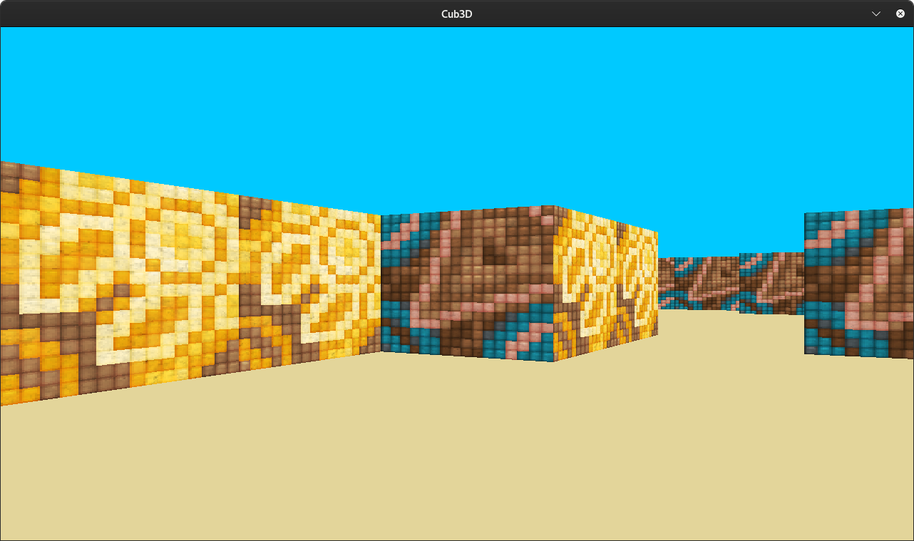
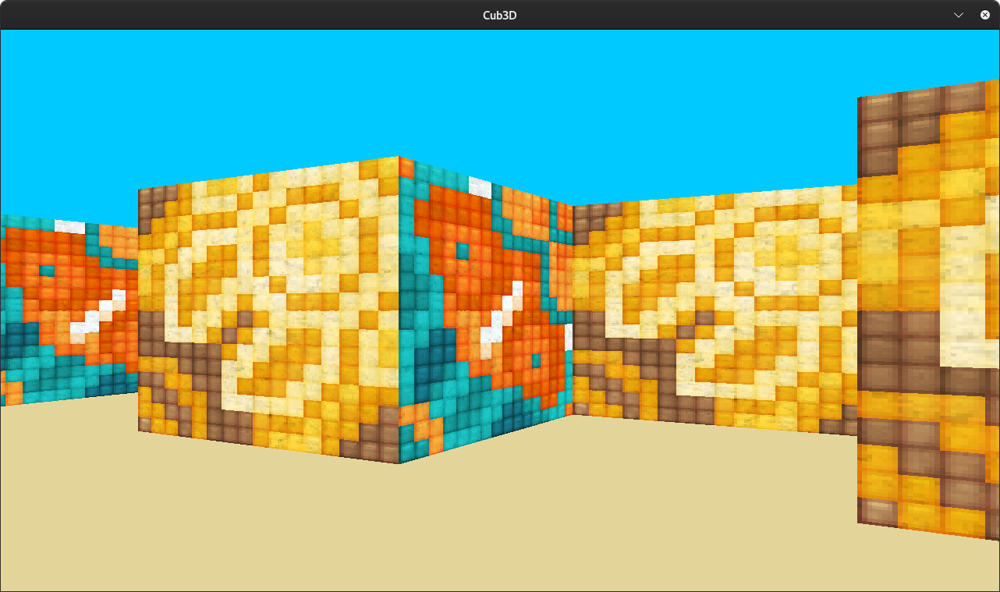

# Project name : cub3D

For this project, the assignment is : 

This project is inspired by the world-famous Wolfenstein 3D game, which was the first FPS ever. It will enable you to explore ray-casting. Your goal will be to make a dynamic view inside a maze, in which you’ll have to find your way.

Made with school graphical library : the MiniLibX.

We must create our own maps in .cub format and we can create our own textures in .xpm format.

Controls for movement and rotation are:

<code>W</code>: move forward 
<code>S</code>: move backward 
<code>A</code>: strafe left 
<code>D</code>: strafe right 
<code>←</code>: rotate left 
<code>→</code>: rotate right 

## Usage

In order to compile :
<code>make</code>

(Only for Linux environment)
Execution :
<code>./cub3D maps/map.cub</code>

## Screenshots

